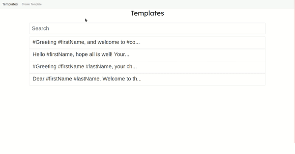
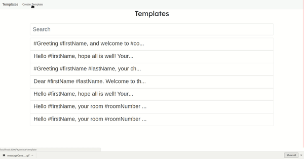

# Traveler-App

## **How to run**

1) First you need [MongoDB](https://docs.mongodb.com/manual/installation/)   installed on your machine.

2) Start the MongoDB and check if database is running by typing either of the following in the terminal 
    *  ```netstat -plntu``` (should show that mongoDB is listening on port 27017)
    * ```mongo``` (this command will start mongo shell) 
3) Clone the repository 
4) If you want this app to be able to send emails then modify the following file: `routes/config/credentials.js`

```js
{
    userName: "yourEmail@email.com",
    password: "yourEmailPassword",
    service: "gmail" 
}
```

5) run the following in the project home directory:

    1) ```npm install``` (Installs all dependencies for server side)
    2) ```npm run client-install``` (Installs all dependencies for client side)
    3) ```npm run dev``` (Runs the server and client concurrently. It will also create a new database in MongoDB called "travelerApp")

### App will be running at [http://localhost:3000](http://localhost:3000/#/)

<br>

## **Tech Stack**

This is a MERN stack app <br>
**Fron-End**: React<br>
**Back-End**: MongoDB, Node.js and Express.js


___

### **MongoDB**

There are three data files in the `database/data`: 
* `Companies.json`
* `Guests.json`
* `Templates.json` (This file was made by me)
<br>

There are three models that are used to describe the structure of the collection in the database. Models are located in the `database/models`
<br>
The `template.js` model looks like this:

```js
const templateSchema = new Schema({
    messageTemplate: {
        type: String,
        required: true
    },
    variableNames: [String] 
});
```
`messageTemplate`: is a string that will contain the template text.
<br>
`variableNames`: is a array which contains placeholders/variables (i.e #firstName) that will be replaced by actual values.


___

### **Node.js & Express.js endpoints** 


 ### **1) templates.js**

1) `/api/templates`: GET api that returns a lits of templates which are stored in the database.
2) `/api/templates/save`: POST api that saves a new template into the database


### **2) guests.js and companies.js**

1) `/api/companies`: GET api that returns a lits of companies which are stored in the database.
2) `/api/guests`: GET api that returns a lits of guests which are stored in the database.

### **3) emailer.js**
1) `/api/emailer` POST api that sends email to the address that was provided by user
___

### **Front-End: React**


### Message generating process
1) List of available templates (`Templates.js`). 
2) Selected template (`SelectedTemplate.js`)
3) Pop up window that lets you to choose a guest or company (`PopUpSelector.js`)
<br>
This what it looks like all combined: 



### Creating a new template process

1) Template editor that let you to create a new template (`TemplateEditor.js`)
2) `data.js` contains names of placeholders such as #firstName, #company, #roomNumber
<br>
This is how editor works:




### Email sender
I used [Nodemailer](https://nodemailer.com/about/) to implement a feature that lets user to send the generated message by email. 
___

## Things to add:
1) Integrate some messenger system that would let you send SMS messages not just emails.
2) Implement a feature tha lets you to pick a set of guests and send message to all of them at once